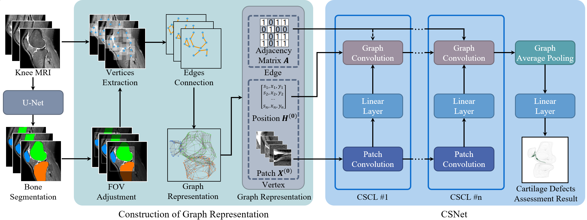
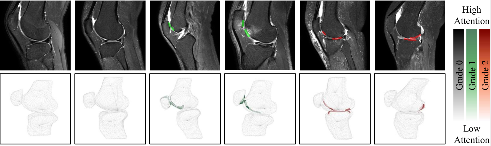

## Cartilage Surface Network (CSNet)
This is an official implementation of the paper [Knee Cartilage Defect Assessment by Graph Representation and Surface Convolution](https://arxiv.org/abs/2201.04318).

## Abstract
Knee osteoarthritis (OA) is the most common osteoarthritis and a leading cause of disability. **Cartilage defects are regarded as major manifestations of knee OA**, which are visible by magnetic resonance imaging (MRI).
However, the physiologic characteristics of the cartilage may hinder such efforts: the **cartilage is a thin curved layer**, implying that only a small portion of voxels in knee MRI can contribute to the cartilage defect assessment; **heterogeneous scanning protocols** further challenge the feasibility of the CNNs in clinical practice; the CNN-based knee cartilage evaluation results lack interpretability.

To address these challenges, we model the cartilages structure and appearance from knee MRI into a  **Graph Representation**. Then, guided by the cartilage graph representation, we design a non-Euclidean deep learning network with the self-attention mechanism, named **Cartilage Surface Network (CSNet)**, to extract cartilage features in the local and global, and to derive the final assessment with a visualized result.

## Framework


## Visualized Diagnostic Results


## Catalog
- [x] Knee Graph Representation code
- [x] Cartilage Surface Network code
- [x] Visualization code
- [x] Reproduced Methods for Comparisons
- [x] [Our Segmentation Tool](https://github.com/zixuzhuang/LabelMore)

## Installation
This code requires PyTorch 1.1+ and DGL 0.6+.
Clone this repo and install the dependencies by
```bash
git clone https://github.com/zixuzhuang/CSNet.git
cd CSNet
pip install -r requirements.txt
```

## Usage
In order to run our framework successfully, the code need to be executed in the following order:

### 1. Transform the knee MRI into the graph representation for computation and the knee mesh for visualization
This step requires knee bone segmentation. We recommend using [our segmenation tool](https://github.com/zixuzhuang/LabelMore) to obtain them.

```bash
python graph_construction.py -org <mri-data> -seg <seg-data> \
 -grade <grade> -graph <graph-save-path> -mesh <mesh-save-path>
```

It can be run directly without any parameters because this demo already comes with them.
```bash
python graph_construction.py
```


### 2. Train the CSNet
```bash
python train_csnet.py -c <config-file> -f <fold-idx> -t <test-mode>
```

It also can be run without parameters. 
```bash
python train_csnet.py
```

Then the corresponding experiment log and model file can be found in `results`.

### 3. Evaluate the result and show the visualization
```bash
python eval_csnet.py -graph <graph-file> -mesh <mesh-file> \
 -net <model-weight-file> -img <visualized-result-save-path>
```

If no parameters are added, it will give results based on the untrained CSNet.
```bash
python eval_csnet.py
```

The visualized result is in in `data/visualization`

## Citation
```
@article{zhuang2022knee,
  title={Knee Cartilage Defect Assessment by Graph Representation and Surface Convolution},
  author={Zhuang, Zixu and Si, Liping and Wang, Sheng and Xuan, Kai and Ouyang, Xi and Zhan, Yiqiang and Xue, Zhong and Zhang, Lichi and Shen, Dinggang and Yao, Weiwu and Wang, Qian},
  journal={arXiv preprint arXiv:2201.04318},
  year={2022}
}
```